  
  
   
  <samp>
    Backend developer crafting LLM-powered services. 
    Obsessed with understanding how things actually work.
  </samp>
  
  <!-- Tech Stack -->
  
   
  
  
  
  <!-- GitHub Stats -->
  
  &nbsp;&nbsp;
  
  
  

